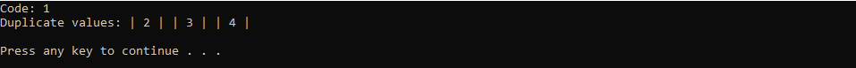

# DuplCheckerModule
*A simple module that uses tuples to return a code followed by a value* 
*to tell you if you have duplicates in your integer list*

## Example of how you can check for duplicates using pre-coded return codes 

```cs
CheckForDuplicates dups = new CheckForDuplicates();
List<int> integerList = new List<int> { 1, 2, 2, 3, 4, 4, 3 };
Tuple<int, List<string>> returntuple = dups.checkDupl(integerList);

int code = returntuple.Item1;
Console.WriteLine("Code: " + code);

List<string> values = returntuple.Item2;

if(code == 1)
{
Console.Write("Duplicate values: ");

foreach (string item in values)
{
  Console.Write("| " + item + " | ");
}
  Console.WriteLine("\n");
} else if (code == 2) {
  Console.WriteLine("Error: " + values[0]);
}
```



Format: 
